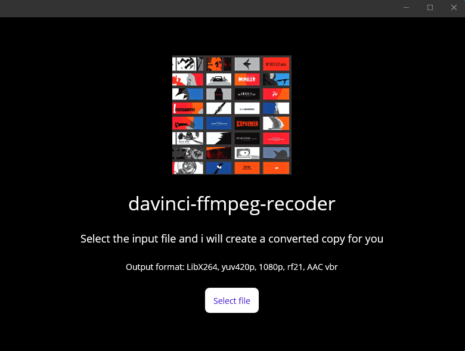

# davinci-ffmpeg-recoder  
A small app that uses FFMPEG to convert video files of most formats  
to a format compatible with movie editing software DaVinci Resolve  

You select a input file and the app will re-encode a copy to the output format:  
LibX264, yuv420p, 1080p, rf21, AAC vbr

## Releases  
Built releases can be found on the releases page. Msix installer, unsigned (requires developer mode activated in Windows 11)  
[https://github.com/studiefredfredrik/davinci-ffmpeg-recoder/releases](https://github.com/studiefredfredrik/davinci-ffmpeg-recoder/releases)

## Development  
The executables for FFMPEG are not included in this repo, but the latest FFMPEG builds can be  
downloaded from [https://ffmpeg.org/download.html](https://ffmpeg.org/download.html)  
The latest FFMPEG builds as windows .exe are available on [https://www.gyan.dev/ffmpeg/builds/](https://www.gyan.dev/ffmpeg/builds/)  

There is a folder in the repo called `put_ffmpeg_exe_and_ffprobe_exe_inside_here`  
where you need to put the downloaded `ffmpeg.exe` and `ffprobe.exe` files.

## Screenshot

